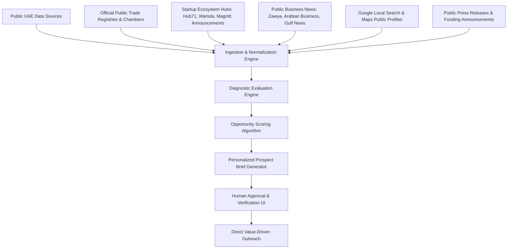

# UAE Lead Intelligence & Discovery System — Architectural Blueprint

> **Compliance & Ethics Guarantee**: This system is designed around **100% legal, ethical, and publicly permitted data discovery**. It strictly avoids bypassing CAPTCHAs, paywalls, anti-bot systems, private logins, or non-compliant scraping. It utilizes permitted public datasets, RSS feeds, official search engines, and manual human-in-the-loop verification.

---

## 1. System Objective

To discover high-potential UAE business prospects (startups, newly launched companies, funded SMEs, and service firms) experiencing observable digital bottlenecks:
* Poor mobile website performance / slow Core Web Vitals
* Low Google search visibility / missing Local SEO Pack
* Broken or high-friction lead funnels (e.g. no WhatsApp integration, manual forms)
* Zero automated lead handling or CRM connectivity

---

## 2. Permitted Public Data Ingestion Sources



### Ingestion Channels
1. **Public Business News & PR Feeds**:
   * Official RSS/Press Feeds from *Zawya UAE*, *Arabian Business*, *Gulf News*, *WAM (Emirates News Agency)*.
   * Target triggers: New office openings in Dubai/Abu Dhabi, seed funding announcements, retail launches, new clinic openings.
2. **Startup & Accelerator Portfolios**:
   * Public cohort lists from *Hub71 (Abu Dhabi)*, *DIFC FinTech Hive*, *In5 Incubator*, *Dubai Future District Fund*.
3. **Public Search Engine Discovery**:
   * Google search for niche commercial keywords with weak top-ranking competitors (e.g., `"interior fitout Sharjah"`, `"accounting firm Business Bay"`).
4. **Google Maps Public Local Profiles**:
   * Identification of claimed/unclaimed profiles with low review response rates, missing website links, or slow connected sites.

---

## 3. Multi-Metric Opportunity Scoring Algorithm

Each discovered business is evaluated across four core dimensions (0–100 total score):

$$\text{Opportunity Score} = (\text{Web Gap} \times 0.30) + (\text{SEO Gap} \times 0.30) + (\text{Automation Gap} \times 0.25) + (\text{Momentum} \times 0.15)$$

```
┌─────────────────────────────────────────────────────────────────────────────┐
│ 1. WEBSITE GAP SCORE (Max 30 pts)                                           │
│  - Mobile PageSpeed Score < 50: +10 pts                                     │
│  - Missing SSL / HTTPS warnings: +5 pts                                     │
│  - No direct WhatsApp CTA button: +8 pts                                    │
│  - Non-responsive mobile viewport: +7 pts                                   │
├─────────────────────────────────────────────────────────────────────────────┤
│ 2. SEO GAP SCORE (Max 30 pts)                                               │
│  - Missing Google Business Profile verification: +10 pts                    │
│  - Not in Google Maps 3-Pack for core keyword: +10 pts                      │
│  - Missing H1, meta descriptions, or title tags: +5 pts                     │
│  - Zero structured Schema.org JSON-LD: +5 pts                               │
├─────────────────────────────────────────────────────────────────────────────┤
│ 3. AUTOMATION GAP SCORE (Max 25 pts)                                        │
│  - Generic form with no instant confirmation or routing: +10 pts            │
│  - No automated booking link (Calendly / WhatsApp): +8 pts                  │
│  - Manual email inquiries only: +7 pts                                      │
├─────────────────────────────────────────────────────────────────────────────┤
│ 4. BUSINESS MOMENTUM SCORE (Max 15 pts)                                     │
│  - Recent funding announcement (< 90 days): +10 pts                         │
│  - Active hiring on public job portals: +5 pts                              │
└─────────────────────────────────────────────────────────────────────────────┘
```

### Classification Tiers
* **High Opportunity (Score 75 - 100)**: Immediate outreach candidate with severe conversion leakage and active budget.
* **Medium Opportunity (Score 50 - 74)**: Strong prospect for targeted SEO or web redesign.
* **Low Opportunity (Score < 50)**: Well-optimized business; skip or monitor.

---

## 4. Prospect Database Schema (SQL / Airtable / Supabase)

```sql
CREATE TABLE prospects (
    id UUID PRIMARY KEY DEFAULT gen_random_uuid(),
    company_name VARCHAR(255) NOT NULL,
    website_url VARCHAR(255),
    emirate VARCHAR(50) CHECK (emirate IN ('Dubai', 'Abu Dhabi', 'Sharjah', 'Ajman', 'RAK', 'Fujairah', 'UAQ')),
    industry VARCHAR(100),
    source_type VARCHAR(100), -- 'Public PR', 'Hub71 Portfolio', 'Google Local Search'
    discovery_date DATE DEFAULT CURRENT_DATE,
    
    -- Diagnostic Scores (0-100)
    pagespeed_mobile INT,
    seo_health_score INT,
    has_whatsapp_cta BOOLEAN DEFAULT FALSE,
    has_local_pack_ranking BOOLEAN DEFAULT FALSE,
    opportunity_score INT,
    priority_tier VARCHAR(20) CHECK (priority_tier IN ('High', 'Medium', 'Low')),
    
    -- Public Contact Information
    public_contact_email VARCHAR(255),
    public_business_phone VARCHAR(50),
    public_whatsapp_number VARCHAR(50),
    founder_public_profile VARCHAR(255),
    
    -- Automated Intelligence Brief
    key_bottleneck TEXT,
    recommended_solution TEXT,
    prospect_brief_markdown TEXT,
    
    -- Pipeline Status
    status VARCHAR(50) DEFAULT 'Discovered' 
      CHECK (status IN ('Discovered', 'Audited', 'Brief Generated', 'Human Approved', 'Contacted', 'In Discussion', 'Proposal Sent', 'Won', 'Archived')),
    
    created_at TIMESTAMP WITH TIME ZONE DEFAULT NOW(),
    updated_at TIMESTAMP WITH TIME ZONE DEFAULT NOW()
);
```

---

## 5. Automated Prospect Brief Generator

Before any outreach is approved, the system generates a concise, 1-page intelligence brief:

### Example Prospect Brief Output
```markdown
# PROSPECT INTELLIGENCE BRIEF
- Company: Al Wasl Commercial Fitout
- Location: Business Bay, Dubai
- Website: https://alwaslfitout-demo.ae
- Opportunity Score: 84/100 (HIGH PRIORITY)

## Observable Bottlenecks:
1. Mobile Load Time: 4.8s on 5G (Heavy uncompressed hero banner).
2. Local Search Gap: Unclaimed Google Business Profile for "commercial fitout Business Bay".
3. Friction: Contact form has 9 required fields with no WhatsApp click-to-chat option.

## Recommended Pitch Strategy:
Offer a 3-minute video breakdown of their mobile speed bottleneck and a preview of a 1-click WhatsApp consultation widget. Emphasize how competitors in Business Bay are capturing commercial inquiries through Google 3-Pack.

## Proposed Outreach Channel:
Direct WhatsApp message to public business inquiry line + LinkedIn connection to Founder.
```

---

## 6. Human-In-The-Loop (HITL) Workflow & Safety Safeguards

1. **Zero Mass Blasts**: Messages are never sent in bulk or automated spam loops.
2. **Founder Review**: The founder reviews the generated brief, inspects the website manually, and customizes the outreach note.
3. **Value-First Offer**: The prospect is never asked to buy immediately; they are offered a complimentary, personalized 3-minute diagnostic insight.
4. **Opt-Out Respect**: If a prospect indicates no interest, their status is set to `Archived` immediately.
