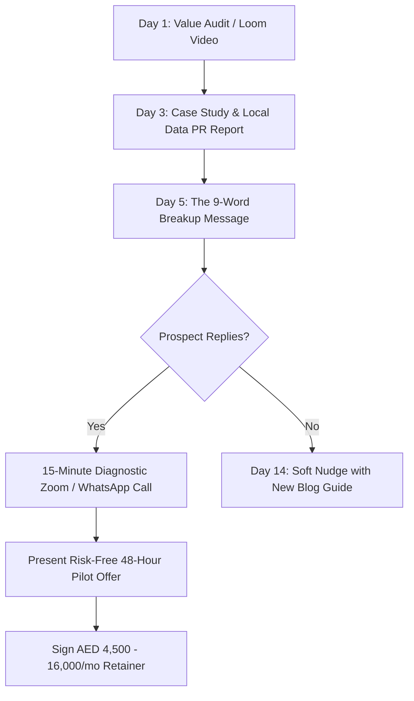

# 🇦🇪 ApexFlow Digital — UAE High-Ticket Client Acquisition & Cold Outreach Kit

This master toolkit contains copy-paste scripts, video teardown frameworks, and follow-up cadences engineered specifically for the UAE commercial ecosystem (Dubai, Abu Dhabi, Sharjah). Every script leverages ApexFlow Digital's live tools:
* **Cyber Audit Diagnostic Tool:** `https://apexflow-digital.vercel.app/audit.html`
* **Automation ROI Simulator:** `https://apexflow-digital.vercel.app/calculator.html`
* **Custom Growth Configurator:** `https://apexflow-digital.vercel.app/packages.html`
* **Direct WhatsApp:** `+971 50 750 7963`

---

## 🏢 NICHE 1: Dubai Luxury Real Estate Brokerages & Property Consultancies

### Target Profiles
* **Titles:** Managing Director, Principal Broker, Head of Sales, Partner.
* **Locations:** Business Bay, Downtown Dubai, Dubai Marina, Palm Jumeirah.
* **Core Pain:** Wasted Meta/Google Ad spend due to 3+ hour lead follow-up lag; slow mobile property landing pages losing international HNW buyers.

---

### Script 1A: Direct WhatsApp Outreach (Primary Channel in UAE)
*Send to the agency's dedicated listing / marketing WhatsApp number:*

> "Hi [Name], noticed your luxury villa listings across [Community, e.g., Palm Jumeirah / Business Bay]. 
> 
> Quick observation from our tech team: when international HNW buyers submit inquiries on your property pages, the mobile load takes ~3.8 seconds, and standard broker response lag averages over 2 hours during busy periods. During that delay, research shows 65%+ of buyers submit inquiries to competing brokerages.
> 
> We recently engineered an automated conversational WhatsApp AI pipeline for UAE real estate that engages buyers in **under 20 seconds**, qualifies budget brackets (e.g. AED 5M vs AED 25M+), and books private viewing slots directly onto your brokers' calendars.
> 
> We ran a quick speed and conversion audit for your site here:
> 👉 https://apexflow-digital.vercel.app/audit.html
> 
> Would you be open to a 3-minute video showing the 2 technical fixes to stop lead leakage?"

---

### Script 1B: LinkedIn InMail / Direct Message
*Connect with note (under 300 characters):*
> "Hi [First Name], saw your team's off-plan & luxury portfolio in [Area]. Did a quick 5G speed test on your website—takes ~4s to render, bouncing qualified ad traffic before buyers see floor plans. Put together a 60-second teardown with 2 quick fixes: [Loom Link]. Hope it helps your team!"

*Follow-up message once connected:*
> "Thanks for connecting, [First Name]! 
> 
> To give you quick context: we specialize in sub-second web engineering and sub-30s WhatsApp qualification engines specifically for Dubai brokerages. 
> 
> You can see our exact architectural blueprint and how we boosted qualified inbound leads by 280% here:
> 👉 https://apexflow-digital.vercel.app/services/dubai-real-estate-lead-generation.html
> 
> If you have 5 minutes this week, I'd love to share how we can deploy a 48-hour pilot for your team with zero upfront risk."

---

### Script 1C: 90-Second Loom Video Teardown Framework
1. **0:00 - 0:15 (The Hook):** *"Hi [Name], Sahil here from ApexFlow Digital in Dubai. I was looking at your luxury listings in Business Bay and noticed a major technical revenue leak on your mobile site that’s costing your brokers qualified viewings."*
2. **0:15 - 0:45 (The Proof):** Open their website in Google Chrome DevTools (Mobile View) and show their Google PageSpeed score. *"Right now, your Largest Contentful Paint takes 4.1 seconds on UAE 5G. For every second of delay, 12% of high-net-worth buyers bounce before your WhatsApp button even renders."*
3. **0:45 - 1:15 (The Solution):** Switch to your screen showing `https://apexflow-digital.vercel.app/audit.html` and show the sub-30s WhatsApp bot architecture diagram. *"When we rebuild property funnels on Next.js, pages load in 0.4 seconds, and our WhatsApp AI bot qualifies budgets in Arabic or English within 18 seconds."*
4. **1:15 - 1:30 (The Soft Call to Action):** *"No pitch—if you want me to send over the 3 specific fixes your web developer can implement today, just reply to this message. Have a great week!"*

---

## 🦷 NICHE 2: Dental, Aesthetic & Medical Clinics in Dubai

### Target Profiles
* **Titles:** Clinic Director, Medical Director, Managing Partner, Head of Patient Relations.
* **Locations:** Jumeirah, Dubai Marina, Healthcare City, Al Wasl Road.
* **Core Pain:** 25%–35% patient appointment no-shows; Google Maps profile ranking at #7–#12 behind competitors with fewer reviews; receptionist phone queues.

---

### Script 2A: Direct WhatsApp / Instagram DM
*Clinics in Dubai live on Instagram and WhatsApp:*

> "Hi Dr. [Last Name] / [Clinic Name] Team! 
> 
> You have an outstanding reputation with over [X] 5-star reviews on Google Maps, but your profile is currently sitting at #8 for '[Specialty, e.g., Cosmetic Dentist / Aesthetic Clinic] in [Location]'—behind clinics with fewer reviews and worse ratings.
> 
> Ranking in the top 3 (Google Maps 3-Pack) typically surges inbound patient calls by 2.5x without spending an extra dirham on Google Ads. The only difference is local entity schema and geo-citations.
> 
> Furthermore, we deploy automated WhatsApp appointment confirmation workflows that slash patient no-shows by 65% with 1-click calendar sync.
> 
> Check out our documented Dubai clinic case study:
> 👉 https://apexflow-digital.vercel.app/services/whatsapp-chatbot-for-clinics-dubai.html
> 
> Would you like a complimentary 3-Pack gap report comparing your clinic against the top 3 in your area?"

---

### Script 2B: Cold Email / LinkedIn to Clinic Operations Manager

**Subject:** Quick question regarding patient booking drop-offs at [Clinic Name]

> "Dear [First Name],
> 
> I noticed [Clinic Name]'s stellar reputation on Al Wasl Road. 
> 
> We recently analyzed booking friction across 100+ private clinics in Dubai. Three critical bottlenecks cause clinics to lose 30%+ of potential treatment revenue:
> 1. Receptionist response delays during peak consultation hours (average lag: 45 minutes).
> 2. Booking forms that redirect to external portals rather than conversational WhatsApp.
> 3. Zero automated WhatsApp reminders leading to 25%+ patient no-shows.
> 
> We build bilingual WhatsApp AI booking engines that allow patients to select doctor slots, confirm appointments in 20 seconds, and receive automated WhatsApp reminders.
> 
> You can simulate your exact monthly payroll and time savings here:
> 👉 https://apexflow-digital.vercel.app/calculator.html
> 
> Open to a 5-minute chat on WhatsApp this Tuesday at 11 AM?
> 
> Best regards,
> **Sahil Sheoran**
> Founder & Principal Technologist | ApexFlow Digital UAE
> WhatsApp: +971 50 750 7963 | https://apexflow-digital.vercel.app"

---

## 🛒 NICHE 3: UAE Shopify & GCC E-Commerce Brands

### Target Profiles
* **Titles:** Founder, E-Commerce Director, Head of Growth, CMO.
* **Markets:** UAE, Saudi Arabia, Kuwait, Qatar.
* **Core Pain:** Cash-on-Delivery (COD) fraud & return-to-origin (RTO) rates of 25%+; cart abandonment due to missing Tabby/Tamara BNPL or slow mobile checkouts.

---

### Script 3A: Direct LinkedIn / WhatsApp Outreach

> "Hi [First Name], love what you've built with [Brand Name]!
> 
> Quick technical question: what is your current return-to-origin (RTO) rate on Cash-on-Delivery (COD) orders across the UAE and KSA?
> 
> Most GCC fashion and DTC brands we talk to lose 22% to 30% of their gross margin on fake addresses, phone misdials, and delivery refusals at the door.
> 
> We built an event-driven WhatsApp AI verification bot that triggers the moment a customer hits 'Place Order':
> 1. Dispatches an instant WhatsApp pin-drop confirmation in Arabic/English.
> 2. Verifies the customer's exact GPS delivery location.
> 3. Converts 20%+ of COD orders into prepaid Apple Pay / Tabby installments upfront.
> 
> This single automation lifts delivery fulfillment rates from 68% to 92%+.
> 
> We wrote a complete technical teardown of the architecture here:
> 👉 https://apexflow-digital.vercel.app/blog/shopify-ecommerce-uae-tabby-tamara-cro-guide.html
> 
> Would love to share the exact webhook workflow if you have 3 minutes?"

---

## 🤝 NICHE 4: Corporate Setup & Company Formation Partners (The Infinite Referral Pipeline)

### Target Profiles
* **Titles:** Business Setup Consultant, PRO Specialist, Freezone Advisor.
* **Companies:** Creative Zone, Virtuzone, Meydan Free Zone, Shuraa, IFZA agents, independent PROs.
* **The Opportunity:** They register 10–30 new commercial entities every month. Every newly formed business urgently needs a website, Google Business Profile, and lead funnel.

---

### Script 4A: LinkedIn Partnership Pitch to Business Setup Agents

> "Hi [First Name], noticed your work helping entrepreneurs establish new commercial licenses across Dubai and the free zones.
> 
> A quick win-win idea for you:
> When your clients finalize their trade license, the very first thing they ask for is a high-speed website, Google Maps setup, and corporate email.
> 
> At ApexFlow Digital, we build high-performance Next.js websites and Google Local search stacks specifically for newly registered UAE companies:
> 👉 https://apexflow-digital.vercel.app/
> 
> We offer our formation partners a **15% to 20% recurring monthly cash referral commission** on every client you introduce to us (averaging AED 1,000 – AED 2,500 per closed package), paid directly to you.
> 
> Can I treat you to a coffee in Business Bay / DIFC this week to introduce myself and discuss how we can pass business to each other?
> 
> Best,
> Sahil Sheoran (+971 50 750 7963)"

---

## 🔄 THE 5-DAY PERSISTENCE CADENCE (How Deals Are Won)

Never stop at one message. 80% of Dubai deals close between the 3rd and 5th interaction.

### Day 3: Follow-Up Script (The Social Proof Drop)
> "Hi [First Name], just published our 2026 benchmark report analyzing 500+ commercial websites across Dubai on 5G mobile load times and WhatsApp response speeds:
> 👉 https://apexflow-digital.vercel.app/blog/state-of-uae-digital-growth-2026-report.html
> Thought you’d find the data on [their industry] interesting. Did you get a chance to review the 60-second video audit I sent over?"

### Day 5: The "9-Word Breakup Message" (Triggers 40%+ Reply Rate)
*When someone hasn't replied, sending this triggers immediate fear of missing out:*
> "Hi [First Name], have you given up on optimizing [Company Name]'s inbound lead funnel for this quarter?"

---

## 🎯 THE 20-MINUTE DISCOVERY CALL CLOSING SCRIPT (Sahil Sheoran Framework)

When a prospect agrees to a call:

1. **Minutes 0 - 3 (Rapport & Proximity):**
   * *"Great to connect, [Name]! Are you based out of your office in [Business Bay / Marina / JLT] today?"*
2. **Minutes 3 - 8 (Diagnose the Pain):**
   * *"Walk me through your current inbound flow. When someone clicks your Google Ad or finds you on Google Maps, how long before they get a human response?"*
   * *"What percentage of your inbound leads actually book a consultation or viewing?"*
3. **Minutes 8 - 14 (Show the Math using the Calculator):**
   * Share screen on `https://apexflow-digital.vercel.app/calculator.html`.
   * Input their numbers: *"If you get 60 leads/month and currently convert 8%, speeding up response time from 2 hours to 20 seconds typically pushes conversion to 18%. That’s 6 extra clients a month with zero extra ad spend."*
4. **Minutes 14 - 18 (The Risk-Free Close):**
   * *"Here's what I propose: let's start with our Full-Stack Growth Retainer (AED 8,500/mo). We engineer your sub-second landing pages and deploy your WhatsApp AI qualification bot in 5 business days. If you don't see qualified appointments landing directly in your calendar in the first 14 days, you don't pay. Fair enough?"*
5. **Minutes 18 - 20 (Immediate Onboarding):**
   * Send WhatsApp confirmation and Google Sheets onboarding form.
